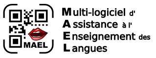

# MAEL Gen

*Una aplicación perteneciente al [__proyecto MAEL__](https://github.com/Yobeco/MAEL_Project)*   

Copyright (c) 2022 Yonnel Bécognée

 

## :fr: [Français](https://github.com/Yobeco/MAEL_Gen/blob/main/README.fr.md) | :es: Español |:gb: [English](https://github.com/Yobeco/MAEL_Gen/blob/main/README.md)

---

## A- Descripción :eye:

:computer: **Aplicación de escritorio multiplataforma** (Linux, macOS y Windows) que permite a los docentes crear fácilmente códigos QR que contienen texto que sus alumnos pueden escuchar.  

Pueden integrarlos en sus distintos materiales didácticos, añadiendo así una **dimensión de audio** :ear: a sus documentos en papel.

Los códigos QR serán escaneados por los alumnos con la aplicación **MAEL Scan** :speaker: (disponible en Android  y pronto en iOS ).

---

## B- Funcionalidades :clipboard:

- **Modo "Leer"**: muestra y lee en voz alta el texto contenido en el código QR.

- **Modo "Dictar"**: no muestra pero lee en voz alta el texto contenido en el código QR.

- **Modo "Deletrear"**: pronuncia en voz alta cada letra del texto contenido en el código QR.

- **Modo "MP3"**: reproduce un archivo almacenado en Google Drive.

- **Sonidos MP3 especiales**: sonidos procedentes del método Borel-Maisonny y del Abecedario Consigny (creado por la zona AMLA Nort).

- **55 idiomas compatibles** (excepto en el modo "Deletrear" por el momento)

:fr: :gb: :es: :portugal: :brazil: :it: :de: :ru: :jp: :cn: :kr: ...

## C- ¿Cómo usar MAEL Gen? :blush:

### 1- Usar una voz sintética :speaking_head:

1. Inicie **MAEL Gen**

2. Introduzca el texto que desea que se reproduzca en el campo de texto (escríbalo, use `Ctrl + v` o simplemente haga `clic derecho`)

3. Elija el idioma (menú `Idioma`) en el que está su texto.

4. Elija el modo (menú `Ajustes`) según su objetivo.

5. Ajuste el tamaño del código QR (campo `Size` o control deslizante)

6. Péguelo en su documento: LibreOffice Writer , Draw  u otro editor cualquiera...

*⟶ El alumno solo tendrá que escanear este código con __MAEL Scan__ para escuchar el contenido :headphones:...*

### 2- Usar un archivo MP3

1. Suba un archivo .mp3 :microphone: a su cuenta de Google Drive 

2. **Comparta** la carpeta donde está el archivo .mp3 **con cualquier persona que tenga el enlace**.

3. Obtenga el enlace para compartir.

4. Pegue este enlace en MAEL Gen.

5. Ajuste el tamaño (campo `Size` o control deslizante).

6. Péguelo en su documento (LibreOffice Writer , Draw  u otro editor cualquiera).

*⟶ El alumno solo tendrá que escanear este código con __MAEL Scan__ para escuchar el archivo MP3 :headphones:: un poema, un diálogo...*

Más información:

---

## D- Principio de funcionamiento :gear:

*(Para ayudar a entender el código)*

---

**:one: Al primer inicio**

Al escribir en el campo de texto, el idioma predeterminado es "francés" :fr: y el modo predeterminado es "Leer":

1- El texto sufre primero un "encriptado" ligero.

2- Se genera un código QR que contiene este texto (`utf-8`).

*⟶ Por defecto, __MAEL Scan__ entenderá que está en __modo Leer__ y utilizará la voz sintética en francés :fr:.*

---

**:two: Si cambia el _idioma_ del contenido, por ejemplo _italiano_ :it:** :

1- El texto que se incluirá en el código QR recibe un prefijo del tipo `<it>`

2- El texto (con su prefijo) sufre primero un "encriptado" ligero.

3- Se genera un código QR que contiene este texto (`utf-8`).

*⟶ __MAEL Scan__ permanecerá en __modo Leer__ pero esta vez utilizará la voz sintética __italiana__ :it:.*

---

**:three: Si cambia al *modo dictar* :**

1- El texto mantiene su prefijo del tipo `<it>`

2- El texto recibe un sufijo del tipo `#d`

2- El texto (con su prefijo y sufijo) sufre primero un "encriptado" ligero.

3- Se genera un código QR que contiene este texto (`utf-8`).

*⟶ __MAEL Scan__ entenderá esta vez que está en __modo Dictar__ y utilizará la voz sintética __italiana__ :it:.*

---

:speaking_head: Las voces sintéticas son las que genera el teléfono. (`GTTS` en Android)

:warning: Algunos idiomas tienen varias voces posibles. Entonces el prefijo será más largo. Por ejemplo:

| Voz | Prefijo |
| ----------- | ----------- |
| Portugués de Portugal :portugal: | `<ptPRT>` |
| Portugués de Brasil :brazil: | `<ptBRA>` |

:bookmark_tabs: [Vea la lista de idiomas de GTTS (Probablemente necesite actualizarse...)](./readme_assets/Langues_GTTS.pdf)

---

**:four: En cada modificación:**

Se genera un archivo `.png` correspondiente al código QR y se envía automáticamente al portapapeles. :clipboard:

(Un pequeño icono indica si en el portapapeles hay un código QR o texto)

*⟶ El profesor solo tiene que `Pegar` en su editor personal.*

---

## E- Funcionalidades por desarrollar :rocket:

1- **Modo "Dictar"**

- El _**"Modo Dictar"**_ actual (oralizar el texto pero no mostrarlo) cambiará de nombre y se llamará **"Modo ocultar"**. :arrows_counterclockwise:

- El nuevo _**"Modo Dictar"**_ incluirá:

    - la lectura del texto sin mostrarlo,
    - la oralización de la puntuación, y
    - la visualización del menú reproducir/pausar :play_or_pause_button: (con barra de desplazamiento).

2- **Modo "MP3"**

- Creación de un **MAEL Cloud** :cloud: con menos limitaciones que Google Drive (alojado con la plataforma **MAEL Phrase**).

- Añadir una opción (sufijo) que indicará a **MAEL Scan** que debe conservar el archivo MP3 :inbox_tray: para no tener que volver a descargarlo si se escanea de nuevo.

3- **Interfaz**

- Reemplazo de TKinter por **TTKBootstrap**

- **Mover los 4 botones de cambio de modo** del menú "Ajustes" a la ubicación del control deslizante de tamaño (que será eliminado).

- Gestión de idiomas que se escriben de derecha a izquierda :arrow_left: como árabe o hebreo.

4- **Verificación por lotes de códigos QR**

Al crear un documento que contiene varios códigos QR, es más fácil cometer errores (por ejemplo, colocar dos veces el mismo código QR... :sweat_smile: ).

Por eso comencé a crear una función de verificación rápida de códigos QR.

1. Propondrá tomar una captura de pantalla del documento a verificar

2. Detectará los códigos QR en la imagen capturada

3. Añadirá en la imagen el texto de cada código QR encontrado

Comencé con **TKinter** para la interfaz de selección del área a capturar (ya usada por MAEL Gen), **mss** para la captura en sí y posiblemente **OpenCV** para la detección y lectura de códigos QR.

### :+1: Ofrezca su ayuda para desarrollar una de estas funciones :smile:

---

# F- :open_hands: ¡Participe en el proyecto MAEL  !

:ring_buoy: Para **obtener ayuda** sobre el uso de **MAEL Gen** o para **participar en el desarrollo** :computer:, escríbame aquí:

### :mailbox_with_mail: ***[mael@lvh.edu.ni](mailto:mael@lvh.edu.ni)***

### :star2: Colaboradores

¡Muchas gracias a todas las personas que contribuirán a este proyecto!

| Avatar | Nombre             | GitHub                          | Rol                      |
|--------|--------------------|---------------------------------|--------------------------|
|  | Bécognée Yonnel | [@Yobeco](https://github.com/Yobeco) | Mantenedor |
|  | Padawan         | [@Nail-yk](https://github.com/Nail-yk) | Traducción de la documentación |
| ... | ... | ... | Desarrolladora Python |

---

## G- Instalación :arrow_heading_down:

Para probar **MAEL Gen**, ejecute el script:

    git clone https://github.com/Yobeco/MAEL_Gen.git
    cd MAEL_Gen
    python3 -m venv mael_venv
    source mael_venv/bin/activate
    pip install -r requirements.txt
    python3 MAEL_V5.0.py