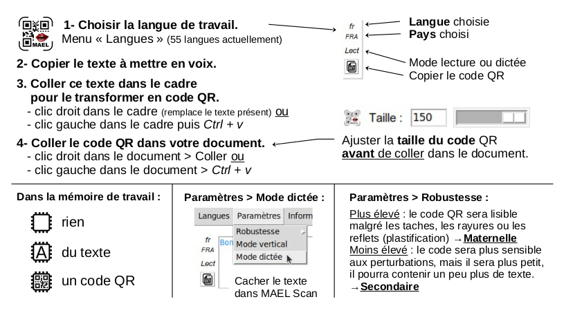

# MAEL Gen

*Une application appartenant au [__projet MAEL__](https://github.com/Yobeco/MAEL_Project)*   
Copyright (c) 2022 Yonnel Bécognée

 

## :fr: [Français](https://github.com/Yobeco/MAEL_Gen) | :gb: English

---

## A- Description :eye:

:computer: **Application de bureau** multi-plateforme (Linux, Mac OS et Windows) qui permet aux enseignants de créer facilement des codes QR contenant du texte que leurs élèves peuvent écouter.  
Ils peuvent les intégrer à leurs différents supports pédagogiques, ajoutant ainsi une **dimension audio** :ear: à leurs documents papier.

Les codes QR seront scannés par les élèves à l'aide de l'application **MAEL Scan** :speaker: (disponible sur Android  et bientôt sur iOS ).

---

## B- Fonctionnalités :clipboard:

- **Mode "lecture"** : affiche et lit à haute voix le texte contenu dans le code QR.
- **Mode "dicter"** : n'affiche pas mais lit à haute voix le texte contenu dans le code QR.
- **Mode "épeler"** : lit à haute voix chaque lettre du texte contenu dans le code QR.
- **Mode "MP3"** : lit un fichier provenant de Google Drive.
- **Sons mp3 spéciaux** : Ce sont des sons issus de la méthode Borel-Maisonny et de l'Abecédaire Consigny (créé par  la zone AMLA Nort)
- **55 langues supportées** (sauf pour le mode "épeler" pour le moment)

:fr: :gb: :es: :portugal: :brazil: :it: :de: :ru: :jp: :cn: :kr: ...

---

## C- Comment utiliser MAEL Gen ? :blush:

### 1- Utiliser une voix de synthèse :speaking_head:

1. Lancez **MAEL Gen**
1. Introduisez le texte que vous souhaitez faire entendre dans le champ de texte (écrivez-le, ou faites `Ctrl + v` ou encore un simple `clic droit`)
1. Choisissez la langue (Menu `Langue`) dans laquelle est votre texte.
1. Choisissez le mode (Menu `Paramètre`) selon votre objectif.
1. Ajustez la taille du code QR (champ `Taille` ou glissière)
1. Collez dans votre document :  LibreOffice Writer , Draw ou n'importe-quel autre éditeur...

*⟶ L'élève n'aura plus qu'à scanner ce code avec __MAEL Scan__ pour écouter le contenu :headphones:...*

### 2- Utiliser un fichier MP3

1. Déposez un fichier .mp3 :microphone: sur votre compte Google Drive 

1. **Partagez** le dossier où se trouve le fichier .mp3 **avec toutes les personnes possédant le lien**.
1. Récupérer le lien de partage.
1. Coller ce lien dans MAEL Gen.
1. Ajustez la taille (champ `Taille`ou glissière).
1. Collez dans votre document (LibreOffice Writer , Draw ou n'importe-quel autre éditeur...).

*⟶ L'élève n'aura plus qu'à scanner ce code avec __MAEL Scan__ pour écouter le fichier mp3 :headphones: : une poésie, un dialogue...*

Plus d'information :

---

## D- Principe de fonctionnement :gear:

*(Pour aider à la compréhension du code)*

---

**:one: Au premier démarrage**

Quand on écrit dans l'entrée de texte, la langue par défaut est "français" :fr: et le mode par défaut est "Lecture" :

1- Le texte subit d'abord un "encryptage" léger.

2- Un code QR contenant ce texte (`utf-8`) est généré.

*⟶ Par défaut, __MAEL Scan__ comprendra qu'il est en __mode lecture__ et utilisera la voix de synthèse française :fr:.*

---

**:two: Si vous changez _la langue_ du contenu, par exemple _italien_ :it:** :

1- Le texte à mettre dans le code QR reçoit un préfixe du type `<it>`

2- Le texte (avec son préfixe) subit d'abord un "encryptage" léger.

3- Un code QR contenant ce texte (`utf-8`) est généré.

*⟶ __MAEL Scan__ reste __mode lecture__ mais il utilisera cette fois la voix de synthèse __italienne__ :it:.*

---

**:three: Si vous changez pour le *mode dicter* :**

1- Le texte garde son préfixe du type `<it>`

2- Le texte reçoit un suffixe du type `#d`

2- Le texte (avec son préfixe et son suffixe) subit d'abord un "encryptage" léger.

3- Un code QR contenant ce texte (`utf-8`) est généré.

*⟶ __MAEL Scan__ comprendra cette fois qu'il est en __mode dicter__ et utilisera la voix de synthèse __italienne__ :it:.*

---

:speaking_head: Les voix de synthèse sont celles générées par le téléphone. (`GTTS` sous Android)

:warning: Certaines langues ont plusieurs voix possibles. Le préfixe sera alors plus long. Par exemple :

| Voix | Préfixe |
| ----------- | ----------- |
| Portugais du portugal :portugal: | `<ptPRT>` |
| Portugais du Bésil :brazil: | `<ptBRA>` |

:bookmark_tabs: [Voir la liste des langues de GTTS (Probablement à actualiser...)](./readme_assets/Langues_GTTS.pdf)

---

**:four: À chaque modification :**

Un fichier `.png` correspondant au code QR est généré et automatiquement envoyé dans le presse-papier. :clipboard:

(Un petit icône indique si dans le presse-papier, il y a un code QR ou du texte)

*⟶ Le professeur n'a plus qu'à faire `Coller` dans son éditeur personnel.*

---

## E- Fonctionnalités à développer :rocket:

1- **Mode "dicter"**

- Le _mode dicter_ actuel (oraliser le texte mais ne pas l'afficher) va changer de nom et s'appeler **"Mode cacher"**. :arrows_counterclockwise:

- Le __nouveau mode dicter__ aura :

    - la lecture du texte, sans son affichage,
    - l'oralisation de la ponctuation et
    - l'affichage du menu lecture-pause :play_or_pause_button: ​(avec barre de défilement) .

2- **Mode "MP3"**

- Création d'un **MAEL Cloud** :cloud: avec moins de limitations que Google Drive (hébergé avec la plateforme **MAEL Phrase**).
- Ajout d'une option (suffixe) qui indiquera à **MAEL Scan** qu'il doit conserver le fichier mp3 :inbox_tray: pour ne pas à avoir à le re-télécharger s'il est scanné à nouveau.

3- **Interface**

- Remplacement de TKinter par **TTKBootstrap**
- **Déplacement des 4 boutons de changement de mode** du menu « Paramètres » vers l'emplacement du curseur de taille (qui sera supprimé).
- Gestion des langues s'écrivant de droite à gauche :arrow_left: comme l'arabe ou l’hébreu.

4- **LibreOffice** 

Quand on crée un document contenant beaucoup de codes QR, il devient plus facile de se tromper. (Mettre deux fois le même code QR par exemple... :sweat_smile: )

*(Pour que le professeur puisse voir d'un seul coup d’œil le mode du code QR, j'avais ajouté un petit carré de couleur en bas à droite.)*

Dans le même esprit, pour pouvoir vérifier facilement le contenu du code QR, j'aurais voulu ajouter son texte dans les méta-données du fichier .png pour que, sous LibreOffice , les métadonnées de l'image apparaissent dans une info-bulle :right_anger_bubble: ou bien quelles soient visibles dans l'inspecteur (colonne de droite).

⟶ Je n'ai pas encore trouvé comment faire quelque-chose de similaire. :disappointed_relieved:

### :+1: Proposez votre aide pour développer une de ces fonctions :smile:

---

# F- :open_hands: Participez au projet MAEL  !

:sos: Pour **obtenir de l'aide** concernant l'utilisation de **MAEL Gen** ou pour **participer au développement** :computer:, écrivez-moi ici :

### :mailbox_with_mail: ***[mael@lvh.edu.ni](mailto:mael@lvh.edu.ni)***

### :star2: Contributeurs

Un grand merci à toutes les personnes qui vont contribuer à ce projet !

 | Avatar | Nom                | GitHub                          | Rôle                     |
 |--------|--------------------|---------------------------------|--------------------------|
 |  | Bécognée Yonnel | [@Yobeco](https://github.com/Yobeco) | Mainteneur |
 | ... | ... | ... | Développeur |
 | ... | ... | ... | Développeuse |
 | ... | ... | ... | Traductrice |

---

## G- Installation :arrow_heading_down:

Pour essayer **MAEL Gen**, exécutez le script :

    git clone https://github.com/Yobeco/MAEL_Gen.git
    cd MAEL_Gen
    python3 -m venv mael_venv
    source mael_venv/bin/activate
    pip install -r requirements.txt
    python3 MAEL_V5.0.py

