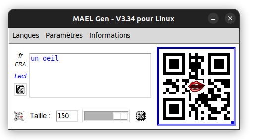

Une application associée au projet MAEL

# MAEL Gen

Copyright (c) 2025 Yonnel Bécognée

 

**Auteur** : Yonnel Bécognée   
**Année** : 2025

---

## A- Description :eye:

Application de bureau multiplateforme (Linux, MacOS et Windows) qui permet aux enseignants de créer facilement des codes QR contenant du texte que leurs élèves peuvent écouter. 
Ils peuvent les intégrer à leurs différents supports pédagogiques, ajoutant ainsi une dimension audio à leurs documents papier.

Les codes QR seront scannés par les élèves à l'aide de l'application **MAEL Scan** :speaker: (disponible sur Android et bientôt sur iOS).

---

## B- Fonctionnalités :clipboard:

- **Mode "lecture"** : affiche et lit à haute voix le texte contenu dans le code QR.
- **Mode "dicter"** : n'affiche pas mais lit à haute voix le texte contenu dans le code QR.
- **Mode "épeler"** : lit à haute voix chaque lettre du texte contenu dans le code QR.
- **Mode "MP3"** : fichier provenant de Google Drive

---

## C- Principe de fonctionnement :gear:

*(Pour aider à la compréhension du code)*

**:one: Au premier démarrage**

Quand on écrit un texte dans l'entrée de texte, la langue par défault est "français" :fr: et le mode par défaut est "Lecture" :

1- Le texte subit d'abord un "encryptage" léger.

2- Un code QR contenant ce texte (utf-8) est généré.

*⟶ MAEL Scan comprendra qu'il est en mode lecture et utilisera la voix de synthèse française :fr:.*

**:two: Si vous changez _la langue_ du contenu par exemple _italien_ :**

1- Le texte reçoit un préfixe du type `<it>`

2- Le texte subit d'abord un "encryptage" léger.

3- Un code QR contenant ce texte (utf-8) est généré.

*⟶ __MAEL Scan__ comprendra qu'il est en __mode lecture__ et utilisera la voix de synthèse de voix __italienne__ :it:.*

**:three: Si vous choisissez le *mode dicter* :**

1- Le texte reçoit un préfixe du type `<it>`

2- Le texte reçoit un siffixe du type `#d`

2- Le texte subit d'abord un "encryptage" léger.

3- Un code QR contenant ce texte (utf-8) est généré.

*⟶ __MAEL Scan__ comprendra qu'il est en __mode dictée__ et utilisera la voix de synthèse de voix __italienne__ :it:.*

Les voix de synthèse sont celles générée oar le téléphone.

:eyes: Certaines langues (avec gtts) ont plusieurs voix possibles, par exemples :

| Voix | Préfixe |
| ----------- | ----------- |
| Portugais du portugal | `<ptPRT>` |
| Portugais du Bésil | `<ptBRA>` |

:bookmark_tabs: [Voir la liste des lagues de GTTS (Probablement à actualiser...)](./readme_assets/Langues_GTTS.pdf)

---

## D- Fonctionnalités à développer :rocket:

1- **Mode "dicter"**

- Le mode dictée actuelle va changer de nom et s'appeler "Mode caché".

- Le mode dictée reste une lecture sans montrer le texte, mais il faudrait :

    - ajouter l'oralisation de la ponctuation et
    - afficher le menu lecture-pause (avec barre de défilement)

2- **Mode "MP3"**

- Création d'un MAEL Cloud avec moins de limitations que Google Drive.

3- **Interface**

- Remplacement de TKinter par **TTKBootstrap**
- **Déplacer les boutons d'accès au changement de mode** du menu « Paramètres » à vers l'emplacement du curseur (qui sera supprimé).
- Gestion des langues s'écrivant de droite à gauche.

**:+1: Vous pouvez proposer votre aider pour developper ces fonctions**

---

## E- Pour participer au développement :arm:

Écrivez moi à :

### 📨 ***[mael@lvh.edu.ni](mailto:mael@lvh.edu.ni)***

---

## C- Installation

Clonez ce dépôt et exécutez le script :

    git clone git://github.com/toncompte/MAEL_Gen.git
    cd phono-fouille
    python3 monscript.py